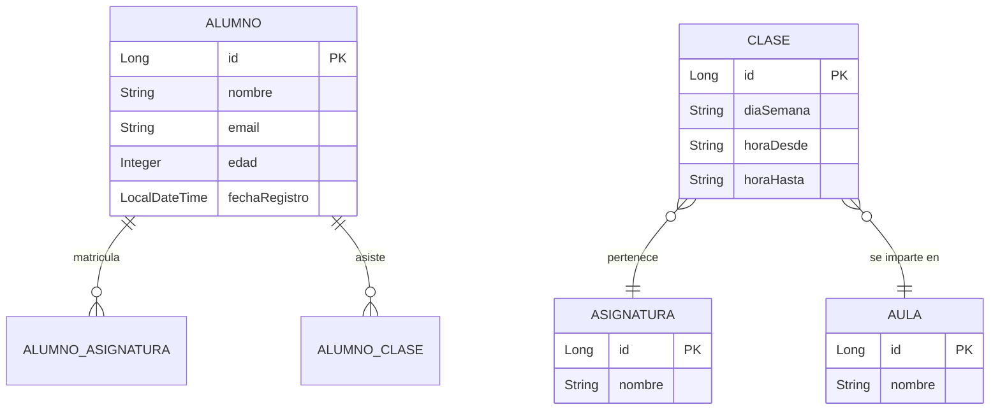

```mermaid
erDiagram
    ALUMNO {
        Long id PK
        String nombre
        String email
        Integer edad
        LocalDateTime fechaRegistro
    }
    ASIGNATURA {
        Long id PK
        String nombre
    }
    CLASE {
        Long id PK
        String diaSemana
        String horaDesde
        String horaHasta
    }
    AULA {
        Long id PK
        String nombre
    }

    ALUMNO ||--o{ ALUMNO_ASIGNATURA : "matricula"
    ALUMNO ||--o{ ALUMNO_CLASE : "asiste"
    CLASE  }o--|| ASIGNATURA : "pertenece"
    CLASE  }o--|| AULA : "se imparte en"
```